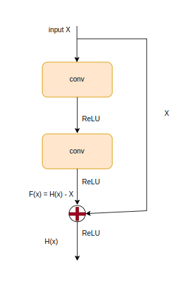

# Deep Residual Learning For Image Recognition

## 出发点

1. 最近的研究证实网络的深度对网络的性能至关重要
2. 梯度消失和梯度爆炸等问题已被标准初始化很好的解决了
3. 但深度网络依旧很难训练，随着网络深度增加，网络性能出现退化现象，这是很不合理的，因为更深的网络参数域原则上是可以覆盖浅层网络参数域，如果浅层已达到最优，那么深层的直接恒等变换即可，为什么出现退化？
4. 由3假设非线性神经网络难以实现恒等变换，网络结构实现恒等变换不一定能使网络性能提升，但能保证不会下降，那么有什么方案可实现恒等变换？
5. 难以实现恒等变换的原因可能是当前已有结构不好优化，或者根本实现不了恒等变换。
6. 有研究表明残差结构更容易优化，能否将残差结构引入深度网络中？

## 总体思路

设计了一类结构，如下描述

模块的总体目标是得到H(x)，但有的时候H(x)不太容易直接得到，就迂回求得H(x)，即引入残差结构，即引入几个卷积层(这里不一定是两个)拟合得到F(x)，文章给出的解释时F(x)更容易优化得到。

## 个人理解

1. shortcut结构将浅层信息传给了深层。
2. 像文中说明那样，非线性网络难以实现恒等变换，而这种结构很容易实现，即F(x)=0，即内部卷积核全为0，恒等变换相当重要，这保证了网络加深不会引起性能下降。
3. 最后一个ReLU有点 不太理解，这会破坏恒等变换。
