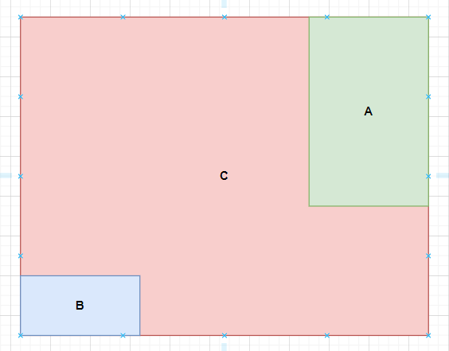

# Generalized Intersection over Union: A Metric and A Loss for Bounding Box Regression

## 出发点 

1.   IOU作为Loss对于没有交集的区域优化不到

## 总体思路

1.  找到一个量可以未相交的两个矩形框

1. 文中找的是$\frac{C - (A \or B)}{C}$ 这个量，解释如下

    

   分子为红色区域，分母为整个区域，文章中说的C表示包含AB最小的凸集，这是不对的，但不影响理解就行

   可以看出，这个量在AB没有相交的情况下越近越小，重合为0，相距无穷远为1

1. 总损失$IOU - \frac{C - (A \or B)}{C}$ 

## 个人理解

1.  IOU作为Loss对于没有交集的区域优化不到，针对这个问题给出了一个可行解。
1.  该文章分析了L型损失和IOU损失存在的问题：L型存在不具有尺度不变性的特征，而且存在多对一的情况，IOU作为Loss对于没有交集的区域优化不到的问题。
1.  最终的解决方案也存在多对一的情况，即多种状态对应一个损失。
1.  存在多对一的情况直接说明了该目标函数是非凸的，即很可能得到的是局部最优解。